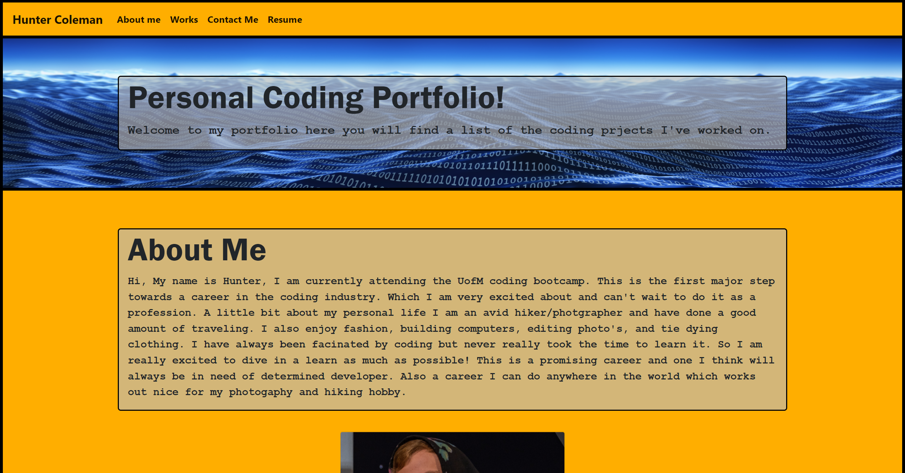
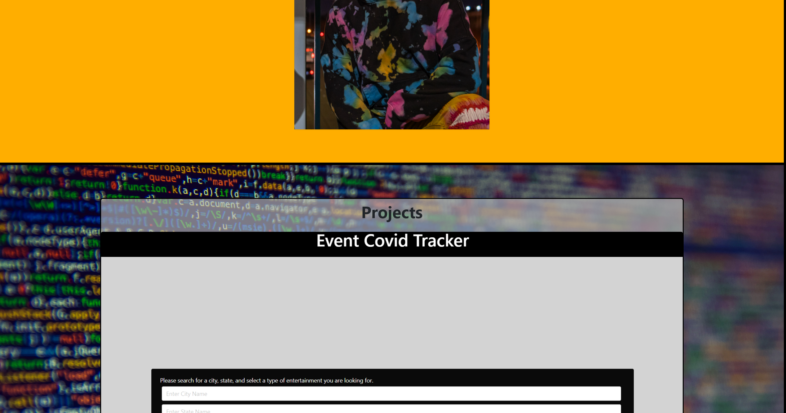
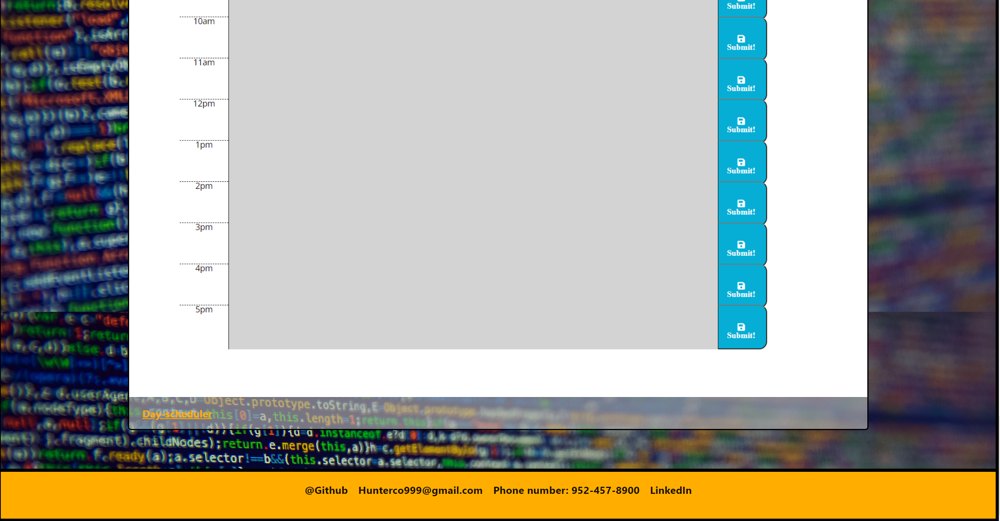

Updated Portfolio Page
============

[deployed page](https://skruphold.github.io/Updated-Portfolio/)

This is a completely new Portfolio that I built cause I figured it be easier than trying to fix the old one. I used a mixture of bootstrap and css to make it look unique. I updated some projects that I've done and also added my personal email and phone number as well as link to my github and my linkedin! 

